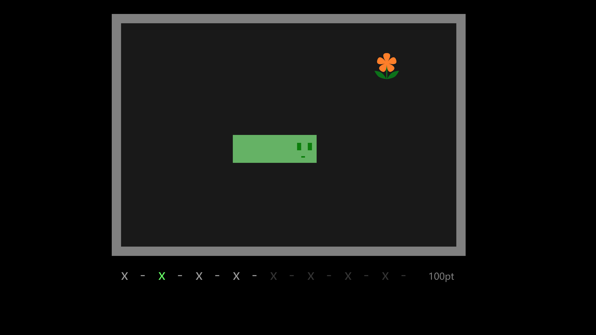
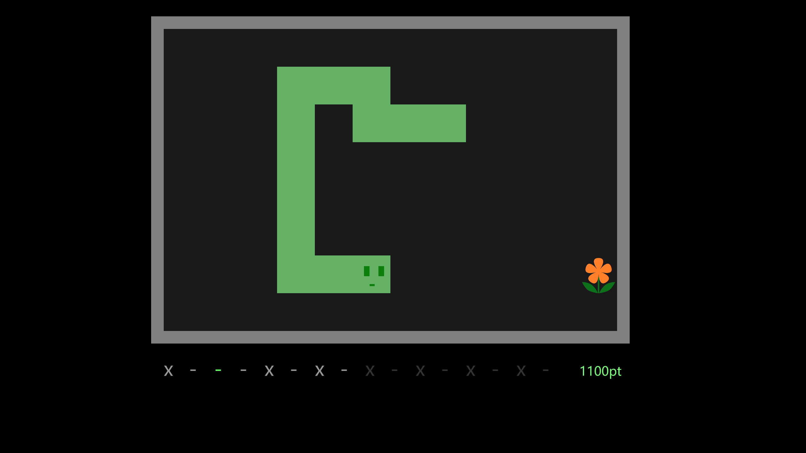

# snaky-rhythm

Snaky Rhythm is a tiny game combining the _Snake_ and rhythm, participating GitHub Game Off 2018.

## Introduction

This is a modification of traditional _Snake_ game. The snake goes with the rhythm!

Use arrow keys to control the snake.

Take care of the bottom bar: **you can only control the snake when "x" is turning green**.

If you have a good sense of music, this game should not be hard :)

[https://lastleaf.github.io/tricolors](https://lastleaf.github.io/tricolors)

Open the URL above in latest desktop Chrome/Firefox (or other browsers with WebGL support).

## Screenshots

## CREDIT

This game is made by LastLeaf (Fu, Boquan), for GitHub Game Off 2018.

**NOTE** the music is extracted from my previous open source game [Leaving Room](https://github.com/LastLeaf/ludum-dare-42) . Sorry that I have no extra time for music creation :(

My GitHub Game Off 2015, 2016, and 2017 games (with different teammates) are also available:

* [A Lighted Story](http://mistymiracle.github.io/a-lighted-story/) - the Game Off 2015 game
* [Boxie Coody](http://lastflower.github.io/game-off-2016) - the Game Off 2016 game
* [TRICOLORS](https://lastleaf.github.io/tricolors) - the Game Off 2017 game

## Technical Details

This is a game written in rust, compiling to the web with emscripten. It based on my half-done framework [glayout](https://github.com/LastLeaf/glayout) . Contact me if you are interested :)

## LISENCE

The content of this game is under [Creative Commons Attribution-ShareAlike 4.0 International](https://creativecommons.org/licenses/by-sa/4.0/). The software of this game is under [MIT LICENSE](https://opensource.org/licenses/mit-license.html).
